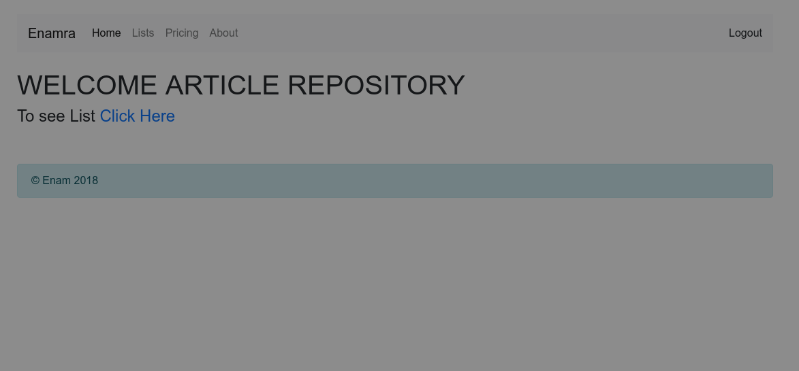

# spring-boot-CRUD-project
  

  spring boot CRUD project using JPA,MYSQL and JSP.
  First create Database `crud_101` in mysql.
  
  set MYSQL user and password in application.properties file.
  
  Run: localhost:8080 
  
  
 # Welcome page 
  
 

 # Course List page
 
   
   
   
 # Add Course  
   
   
   
 # Update Course
   
